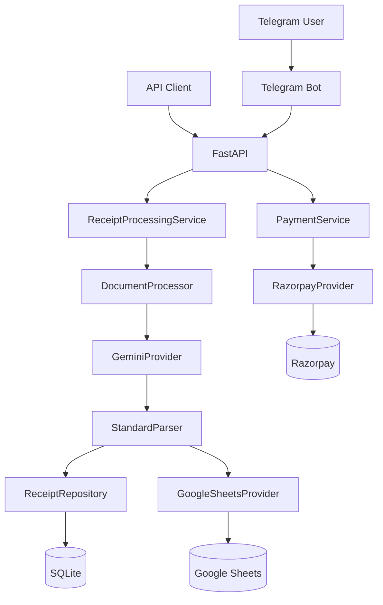

<div align="center">
  
  <h1>OCRBridge</h1>
  <p><strong>AI-powered receipt processing for Indian logistics workflows.</strong></p>
  <p>OCRBridge is a lightweight pipeline that converts receipt documents into structured, usable business data.</p>
  <p>
    
    
    
    
    
  </p>
</div>

## What It Does

- Accepts receipt files (`PDF`, `JPG`, `PNG`, `WEBP`) from API or Telegram.
- Extracts structured fields using Gemini Vision.
- Normalizes key fields (vehicle number, weights, amounts).
- Saves results to SQLite.
- Appends processed rows to Google Sheets.
- Supports Razorpay payment link + webhook flow (optional).

## Architecture



## Stack

- Python, FastAPI, Streamlit
- Gemini (`google-generativeai`)
- SQLAlchemy (SQLite by default)
- Google Sheets API
- Telegram Bot API

## Quick Start

1. Clone and enter project:

```bash
git clone https://github.com/tanishra/ocr-bridge.git
cd ocrbridge
```

2. Create virtual environment and install dependencies:

```bash
python3 -m venv .venv
source .venv/bin/activate
pip install -r requirements.txt
```

3. Create `.env` in project root and set required values:

```env
GEMINI_API_KEY=...
GEMINI_MODEL=...
TELEGRAM_BOT_TOKEN=...
DATABASE_URL=...
GOOGLE_SHEETS_CREDENTIALS=credentials.json
GOOGLE_SHEET_ID=...

# Optional (payments)
RAZORPAY_KEY_ID=
RAZORPAY_KEY_SECRET=
RAZORPAY_WEBHOOK_SECRET=
```

4. Add your Google service account file at the path set in `GOOGLE_SHEETS_CREDENTIALS` (default: `credentials.json`).

## Run

Start API server:

```bash
uvicorn api.main:app --reload --host 0.0.0.0 --port 8000
```

Start dashboard (new terminal):

```bash
streamlit run dashboard/app.py
```

Start Telegram bot (new terminal, optional):

```bash
python -m src.channels.telegram.bot
```

## API Endpoints

- `POST /process` - Process one receipt file.
- `POST /process-batch` - Process multiple files in parallel.
- `GET /health` - Service health check.
- `POST /payments/create-link` - Create Razorpay payment link (optional).
- `POST /webhooks/razorpay` - Razorpay webhook receiver (optional).

## Basic Usage

Process one receipt via API:

```bash
curl -X POST "http://localhost:8000/process" \
  -F "file=@/path/to/receipt.pdf"
```

Health check:

```bash
curl "http://localhost:8000/health"
```

## Contributing

Contributions are welcome.

1. Fork the repository.
2. Create a feature branch.
3. Keep changes focused and minimal.
4. Open a pull request with a clear summary and test steps.